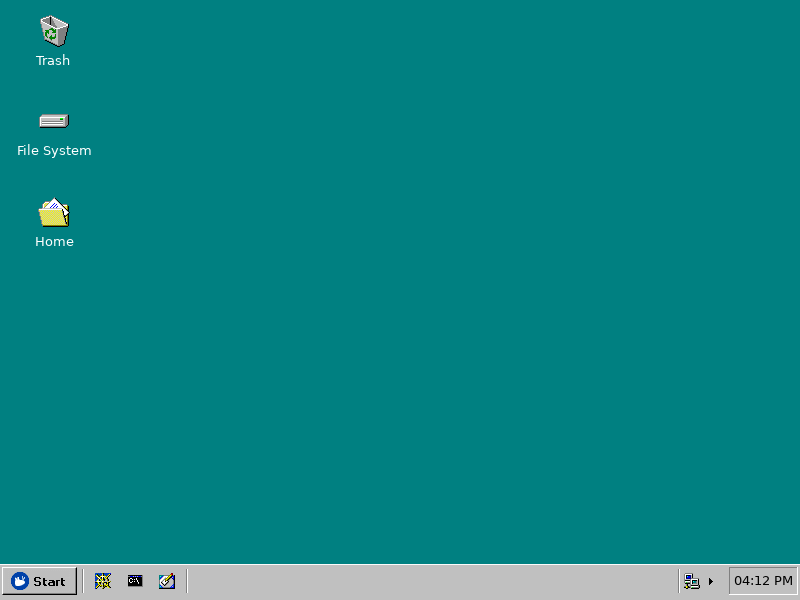
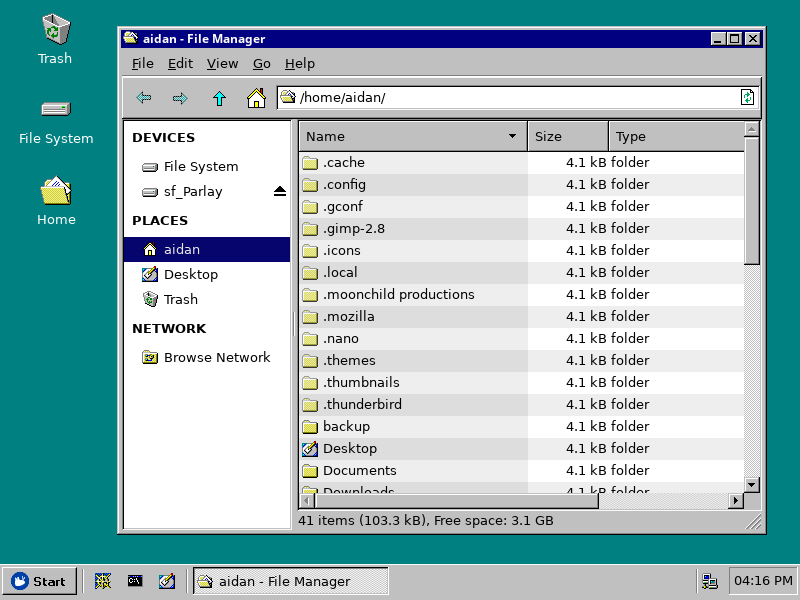
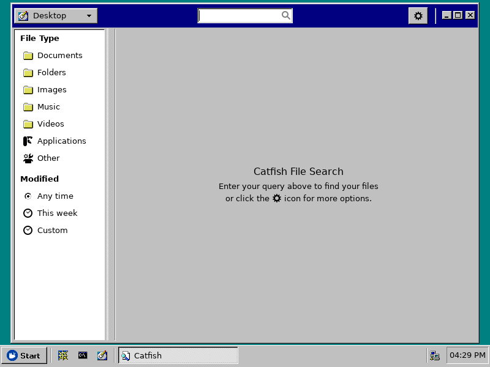
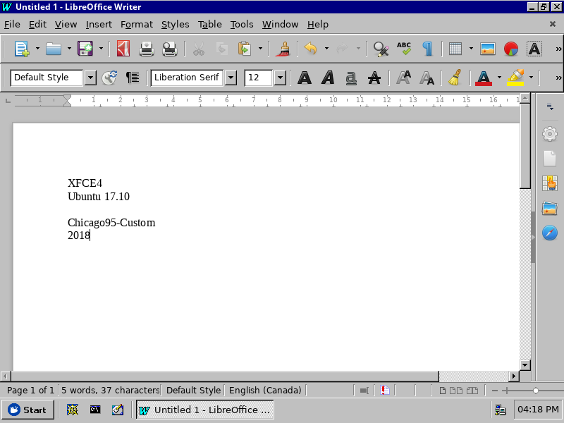
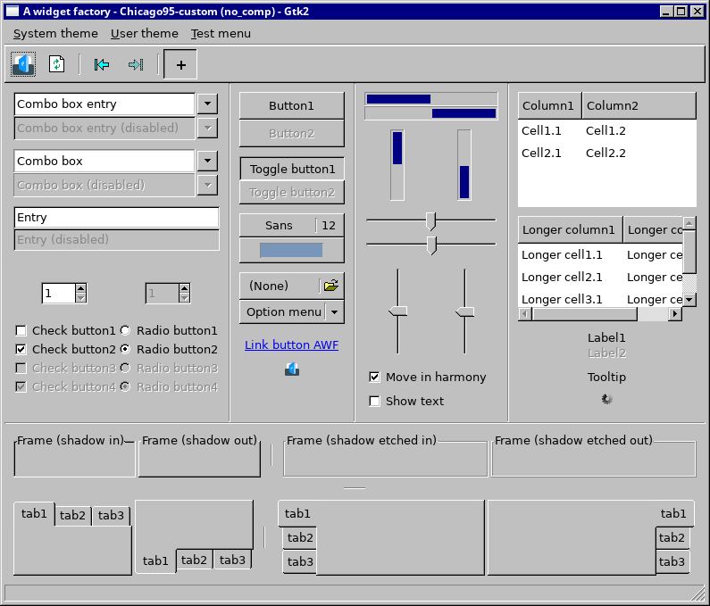
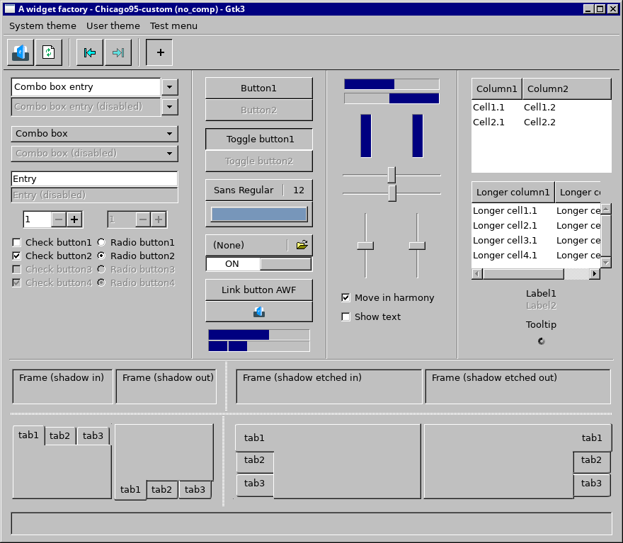
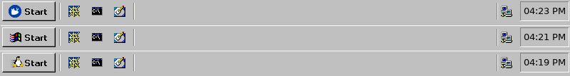

# Chicago95-Custom for XUbuntu 18.04
This is a customized version of the [Chicago95 GTK theme](https://github.com/grassmunk/Chicago95). This is a theme that I've modified for my own purposes and sharing to you. There are two parts of the theme, one strictly for compositing environments with support for GNOME Client Side Decorations and one with cross compatibility for compositing and non-compositing environments. See the INSTALL.md for additional information.

#### Requirements
GTK+ 3.22

Xfce 4.12

(Preferred distro is Xubuntu 17.10 or 18.04)

## Install the system theme
[Click here](INSTALL.md) for install steps.

#### Screenshots

##### Choice of Start button icons for Whisker and XFCE Application panel menus.

## Credits
Grassmunk 4/2016

AdrianoML 12/2016

EMH-Mark-I 4/2017

#### Code and license
License: GPL-3.0+/MIT
